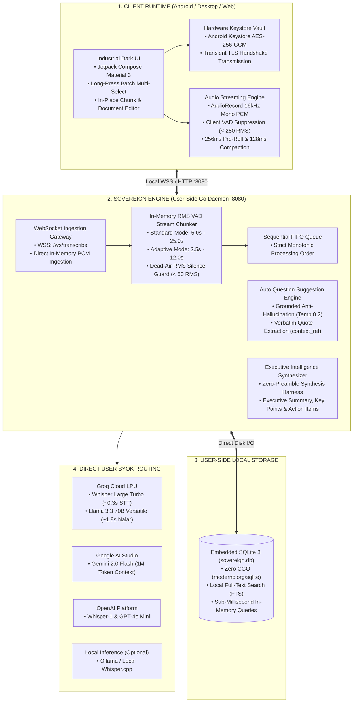

# Sovereign Speech Intelligence (Sovereign Core)

**Enterprise Local-First Real-Time Speech Ingestion, In-Meeting Grounded Inquiry & Executive Intelligence Stack**

[](LICENSE)
[]()
[](https://go.dev/)
[](https://developer.android.com/jetpack/compose)
[](https://sqlite.org/)
[](https://groq.com/)

---

> 🌐 **Language:** **English** | [Versi Bahasa Indonesia](README_ID.md)

---

## 1. Executive Summary & The Sovereign Paradigm

**Sovereign Speech Intelligence** is a fully open-source, local-first speech-to-intelligence ecosystem designed to return complete data sovereignty back to the user. While existing commercial SaaS platforms (Otter.ai, Fireflies.ai) charge high recurring subscriptions ($17–$18/month), enforce vendor lock-in, and store confidential meeting recordings on proprietary multi-tenant cloud servers, Sovereign Core shifts **100% of endpoints and data storage directly to the user's side**.

### Core Architectural Tenets:
* **100% User-Side Storage (Embedded SQLite 3):** All meeting transcripts, audio chunks, and structured executive summaries are stored in an embedded SQLite database (`./data/sovereign.db` or `~/.sovereign/sovereign.db`) using zero-CGO pure Go driver (`modernc.org/sqlite`). Full-text search is powered by SQLite FTS, providing sub-millisecond query retrieval without requiring any external database server.
* **100% User-Controlled Endpoints:** Operates as a lightweight, single-binary daemon on `127.0.0.1:8080` (or `0.0.0.0:8080` for private home labs, LANs, and Tailscale networks). Zero external user tracking, zero centralized telemetry, and zero mandatory cloud gateways.
* **Direct BYOK AI Routing:** Users supply their own personal API keys (Groq Cloud, Google AI Studio, OpenAI, or local Ollama). Audio is transcribed via **Groq LPU Whisper Large Turbo** at ~0.3s latency (free 8 hours/day) and summarized via **Groq Llama 3.3 70B** or **Google Gemini 2.0 Flash**.
* **Zero-Knowledge Hardware Vault:** Keys entered on the mobile client reside exclusively in hardware-backed **Android Keystore (AES-256-GCM)** and are transmitted strictly via TLS 1.3 to transient Goroutine memory, immediately cleared upon socket termination.
* **Dual Ingestion Pipelines:**
  * *Standard Pipeline:* Lossless 16kHz 16-bit Mono PCM streamed with server-side RMS VAD chunking (5.0s–25.0s).
  * *Adaptive Low-Latency Pipeline:* Client-side energy gating (RMS 280.0 silence suppression, saving ~78.2% mobile data), 256ms pre-roll queue, and 128ms (4096 bytes) packet compaction.
* **In-Meeting Grounded Inquiry Engine:** Generates sharp, actionable questions during live discussions across sliding time windows (5m, 15m, 30m, full) backed by verbatim quote references (`context_ref`) to eliminate hallucinations.
* **100% Open Source:** Released permissively under the **MIT License** for unrestricted personal, academic, and enterprise self-hosting.

---

## 2. System Architecture & Topology



---

## 3. Quick Start: Single-Binary Execution

### Option A: Direct Go Binary (Zero External Dependencies)
```bash
# 1. Clone repository
git clone https://github.com/paperalt/sovereign.git
cd sovereign-speech-intelligence

# 2. Build single binary
go build -o bin/sovereign-server ./cmd/server

# 3. Run daemon (runs with embedded SQLite on 0.0.0.0:8080)
./bin/sovereign-server
```

### Option B: Run via Docker Compose (Portable Local Stack)
```bash
# Start lightweight containerized daemon
docker compose -f docker-compose.sqlite.yml up -d

# Verify daemon status
curl -s http://127.0.0.1:8080/health
# Output: {"status":"ok"}
```

---

## 4. Multi-Target Disaster Recovery & Backup

Sovereign Core includes automated multi-target backup and restore scripts (`scripts/backup.sh` and `scripts/restore.sh`):

```bash
# 1. Backup to Local Directory or External USB/HDD
./scripts/backup.sh /var/backups/sovereign

# 2. Backup to Remote Home Server via SSH / SCP
./scripts/backup.sh user@192.168.1.100:/mnt/storage/backups

# 3. Backup to Private Cloud via Rclone (S3, Cloudflare R2, Google Drive)
./scripts/backup.sh r2:my-bucket/sovereign-backups

# 4. Instant One-Command Restoration
./scripts/restore.sh /var/backups/sovereign
```

---

## 5. Technical Specifications Matrix

| Metric / Parameter | Sovereign Speech Intelligence | Traditional Cloud SaaS (Otter.ai, etc.) |
| :--- | :---: | :---: |
| **Data Storage Location** | **100% User-Side (Local SQLite 3)** | Third-Party Centralized Cloud |
| **API Endpoints** | **Localhost / User-Hosted Daemon** | Vendor-Controlled Gateways |
| **Cost & Business Model** | **Free & Open Source (MIT License)** | $17–$18 / month recurring |
| **Transcription Latency** | **~0.30s (Groq LPU Whisper Turbo)** | 2.0s – 5.0s |
| **Data Bandwidth** | **~25 MB / hour (Adaptive VAD Gating)** | 60–120 MB / hour |
| **In-Meeting Inquiries** | **Grounded AI with Citations (`context_ref`)** | None / Static Post-Meeting |
| **Key Vault Security** | **Android Keystore AES-256-GCM** | Vendor Stored / Plaintext |
| **Offline / LAN Capability** | **Full Local Support (LAN / Tailscale)** | Requires Internet & Vendor Login |

---

## 6. Official Repository & License

* **GitHub Repository:** [`https://github.com/paperalt/sovereign`](https://github.com/paperalt/sovereign)
* **Author:** Asmaul Khusna (`@paperalt`)
* **License:** [MIT License](LICENSE) — Free for personal, academic, and commercial self-hosting.
