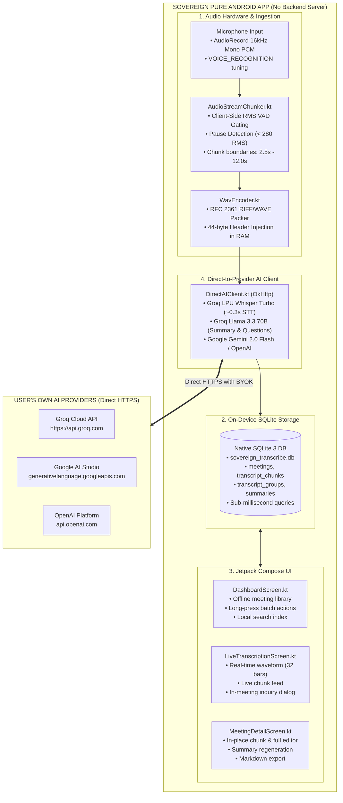

# Sovereign: Pure Standalone Android Speech Intelligence

**Local-First, Zero-Backend Real-Time Speech Ingestion, In-Meeting Grounded Inquiry & Executive Intelligence Engine**

[](LICENSE)
[](https://developer.android.com/)
[](https://kotlinlang.org/)
[](https://sqlite.org/)
[]()
[](https://groq.com/)

---

> 🌐 **Language:** **English** | [Versi Bahasa Indonesia](README_ID.md)

---

## 1. Executive Summary & Pure Client-Side Paradigm

**Sovereign** is a 100% standalone, pure Android application that brings real-time speech transcription, contextual in-meeting inquiry, and executive summarization directly to your mobile device **without any backend server, central database, or intermediary cloud proxy**.

While commercial transcription platforms (Otter.ai, Fireflies.ai) charge $17–$18/month, enforce vendor lock-in, and store confidential meeting recordings on third-party servers, Sovereign operates on a **Pure Local-First Architecture**:

* **Zero Backend Server Required:** No Go server, no Python API, no Docker container, and no remote host to maintain. The application is completely self-contained.
* **100% On-Device Data Storage (Native SQLite 3):** All meeting transcripts, audio chunks, and structured executive summaries are stored in a local SQLite database (`sovereign_transcribe.db`) inside the Android app's private sandbox.
* **On-Device Audio Ingestion & WAV Encoding:** Raw 16kHz, 16-bit Mono Linear PCM from `AudioRecord` is chunked and packed into RFC 2361 compliant RIFF/WAVE byte containers in memory using native Kotlin binary encoders (`WavEncoder.kt`).
* **Client-Side VAD Streaming Chunker:** Voice Activity Detection (VAD) energy gating (< 50 RMS silence suppression, < 280 RMS pause boundary detection, 2.5s–12.0s chunking) runs directly in Kotlin coroutines on the device.
* **Direct Client-to-Provider AI Ingestion:** The app connects directly from the phone to AI providers (Groq Cloud Whisper Turbo, Google AI Studio Gemini 2.0 Flash, or OpenAI Whisper-1) via direct HTTPS multipart/JSON calls using personal API keys.
* **Universal Multi-Endpoint Configuration & Model Auto-Detection:** Users can configure arbitrary custom endpoints and models for Voice (STT) and LLM (Reasoning) independently. The `[DETEKSI]` feature queries the endpoint's `GET /models` to discover and list all available models in real time.
* **Preconfigured Presets via GitHub Raw JSON:** Provider profiles are fetched dynamically from `config/providers.json` on GitHub with offline fallback, enabling one-tap configuration where the user only needs to paste their API key.
* **Hardware-Backed Keystore Vault:** API keys reside exclusively in the **Android Keystore (AES-256-GCM)** via `EncryptedSharedPreferences`. Keys never touch an external server or unencrypted storage.
* **100% Free & Open Source:** Licensed under the permissive **MIT License**.

---

## 2. Standalone Client Architecture



---

## 3. How to Build & Install

### Prerequisites
* JDK 17 or JDK 21
* Android SDK 35 (minSdk 26 — Android 8.0 Oreo or higher)

### Build Debug APK
```bash
# 1. Clone repository
git clone https://github.com/paperalt/sovereign.git
cd sovereign

# 2. Make Gradle wrapper executable
chmod +x gradlew

# 3. Assemble Debug APK
./gradlew assembleDebug

# Output APK path:
# app/build/outputs/apk/debug/app-debug.apk
```

### Install directly to device
```bash
adb install -r app/build/outputs/apk/debug/app-debug.apk
```

---

## 4. Technical Specifications & Features

| Capability | Sovereign (Pure Android) | Cloud SaaS (Otter.ai, etc.) |
| :--- | :---: | :---: |
| **Backend Server** | **NONE (Pure Android App)** | Proprietary Cloud Gateway |
| **Data Storage** | **100% On-Device (Native SQLite 3)** | Vendor Multi-Tenant Cloud |
| **Audio Encoding** | **On-Device (WavEncoder 16kHz)** | Server-side / Cloud transcode |
| **Network Latency** | **Direct HTTPS (~300ms via Groq)** | High (WebSocket hop + Server queue) |
| **Cost** | **$0 / month (Free & Open Source)** | $17–$18 / month recurring |
| **Data Privacy** | **Zero-Knowledge (Data never leaves phone)** | Shared with SaaS vendor |
| **API Key Storage** | **Android Keystore AES-256-GCM** | Stored on vendor servers |
| **License** | **MIT License** | Proprietary Commercial |

---

## 5. Repository & License

* **GitHub Repository:** [`https://github.com/paperalt/sovereign`](https://github.com/paperalt/sovereign)
* **Author:** Asmaul Khusna (`@paperalt`)
* **License:** [MIT License](LICENSE)
