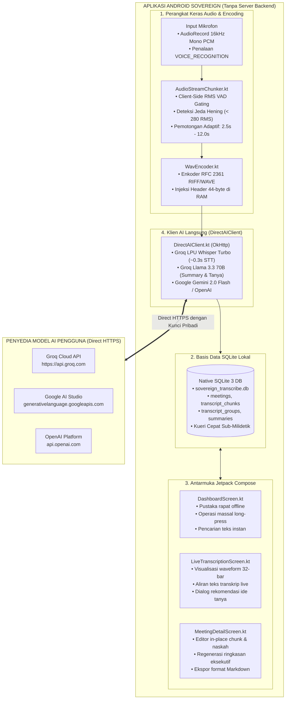

# Sovereign: Aplikasi Android Murni Intelijen Wicara

**Platform Transkripsi Audio Real-Time Mandiri Tanpa Backend, Rekomendasi Pertanyaan Rapat, dan Kedaulatan Data Lokal Penuh**

[](LICENSE)
[](https://developer.android.com/)
[](https://kotlinlang.org/)
[](https://sqlite.org/)
[]()
[](https://groq.com/)

---

> 🌐 **Bahasa:** **Bahasa Indonesia** | [English Version](README.md)

---

## 1. Ringkasan Eksekutif & Paradigma Aplikasi Mandiri (Pure Standalone)

**Sovereign** adalah aplikasi Android mandiri (*pure standalone application*) berlisensi open source murni yang memproses perekaman audio langsung, transkripsi real-time, rekomendasi pertanyaan rapat cerdas, dan perangkuman eksekutif **tanpa memerlukan server backend, basis data terpusat, atau perantara cloud apa pun**.

Di saat layanan transkripsi komersial (seperti Otter.ai atau Fireflies.ai) membebankan biaya langganan rutin ($17–$18/bulan), membatasi pengguna pada vendor tunggal, dan menyimpan rekaman rapat privat di server cloud pihak ketiga, Sovereign menerapkan **Arsitektur Kedaulatan Data Lokal Penuh**:

* **Murni Tanpa Server Backend:** Tidak memerlukan server Go, API Python, kontainer Docker, maupun VPS untuk beroperasi. Seluruh sistem berjalan mandiri di dalam satu aplikasi Android.
* **Penyimpanan 100% di Perangkat (Native SQLite 3):** Seluruh transkrip, potongan rekaman, pengelompokan folder (*groups*), dan ringkasan eksekutif disimpan di basis data SQLite lokal (`sovereign_transcribe.db`) di dalam ruang aman (*internal app storage sandbox*) Android.
* **Ingesti & Encoding Audio Langsung di Android:** Sinyal mentah 16kHz 16-bit Mono Linear PCM dari `AudioRecord` dipotong dan dikemas menjadi kontainer biner standar RIFF/WAVE (RFC 2361) secara in-memory menggunakan enkoder bawaan Kotlin (`WavEncoder.kt`).
* **Client-Side VAD Streaming Chunker:** Voice Activity Detection (supresi hening < 50 RMS, pemotongan jeda bicara < 280 RMS, jendela durasi 2,5s–12,0s) dieksekusi langsung menggunakan coroutine Kotlin di ponsel.
* **Routing AI Langsung Ponsel-ke-Penyedia (Direct HTTPS):** Ponsel terhubung langsung ke API penyedia AI (Groq LPU Whisper Large Turbo, Google AI Studio Gemini 2.0 Flash, atau OpenAI Whisper-1) melalui protokol HTTPS standar menggunakan API key pribadi pengguna tanpa perantara proxy.
* **Konfigurasi Universal Multi-Endpoint & Auto-Deteksi Model:** Pengguna dapat memasukkan endpoint API dan model kustom apa pun secara mandiri untuk Voice (STT) dan LLM (Nalar/Ide Tanya). Tombol `[DETEKSI]` melakukan panggilan otomatis ke `GET /models` untuk mendeteksi daftar model yang tersedia di server target.
* **Preset Terkonfigurasi via GitHub Raw JSON:** Profil penyedia populer (Groq, Google Gemini, OpenAI, DeepSeek, OpenRouter, Ollama) ditarik otomatis dari berkas `config/providers.json` di GitHub (dengan fallback lokal), sehingga pengguna cukup menempelkan API key dari penyedia.
* **Brankas Kunci Keras Android Keystore:** Kunci API pengguna disimpan secara terenkripsi menggunakan **Android Keystore (AES-256-GCM)** via `EncryptedSharedPreferences`. Kunci tidak pernah terekspos ke penyimpanan eksternal atau teks biasa.
* **100% Bebas & Terbuka:** Berlisensi resmi di bawah **MIT License**.

---

## 2. Arsitektur Sistem Klien Mandiri



---

## 3. Panduan Kompilasi & Pemasangan

### Prasyarat
* JDK 17 atau JDK 21
* Android SDK 35 (minSdk 26 — Android 8.0 Oreo ke atas)

### Kompilasi Debug APK
```bash
# 1. Klon repositori
git clone https://github.com/paperalt/sovereign.git
cd sovereign

# 2. Beri hak akses eksekusi gradle wrapper
chmod +x gradlew

# 3. Kompilasi APK
./gradlew assembleDebug

# Lokasi berkas APK hasil kompilasi:
# app/build/outputs/apk/debug/app-debug.apk
```

### Pemasangan Langsung ke Ponsel via ADB
```bash
adb install -r app/build/outputs/apk/debug/app-debug.apk
```

---

## 4. Matriks Perbandingan Teknis

| Kapabilitas / Parameter | Sovereign (Aplikasi Android Murni) | Layanan Cloud SaaS (Otter.ai, dll) |
| :--- | :---: | :---: |
| **Ketergantungan Server Backend** | **TIDAK ADA (Murni di Android)** | Membutuhkan Server Cloud Vendor |
| **Lokasi Penyimpanan Data** | **100% di Perangkat (SQLite 3 Lokal)** | Basis Data Cloud Pihak Ketiga |
| **Enkoding Audio** | **In-Memory di Ponsel (WavEncoder 16kHz)** | Transcoding di Server / Cloud |
| **Latensi Jaringan** | **Direct HTTPS (~300ms via Groq)** | Tinggi (Antrean WebSocket Server) |
| **Biaya Bulanan** | **$0 / bulan (Bebas & Open Source)** | $17–$18 / bulan rutin |
| **Privasi Rekaman** | **Zero-Knowledge (Data tidak keluar HP)** | Tersimpan di server vendor |
| **Penyimpanan Kunci API** | **Android Keystore AES-256-GCM** | Server vendor / teks biasa |
| **Lisensi Perangkat Lunak** | **MIT License** | Lisensi Komersial Terikat |

---

## 5. Repositori Resmi & Lisensi

* **Repositori GitHub:** [`https://github.com/paperalt/sovereign`](https://github.com/paperalt/sovereign)
* **Penulis / Pemilik:** Asmaul Khusna (`@paperalt`)
* **Lisensi:** [MIT License](LICENSE)
