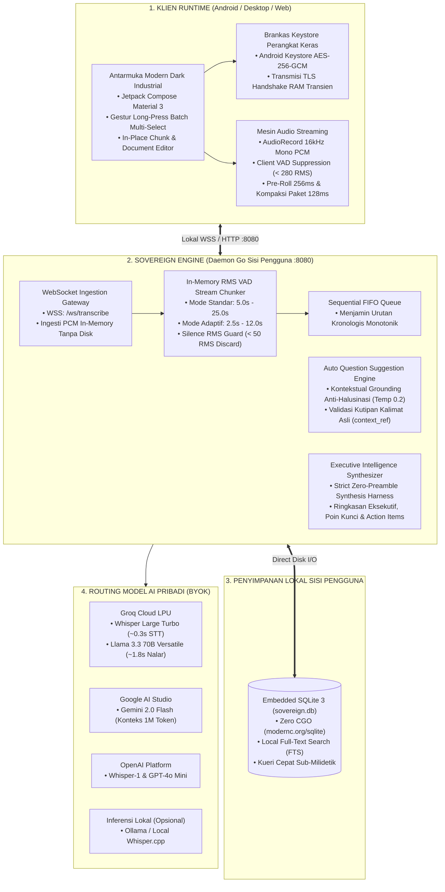

# Sovereign Speech Intelligence (Sovereign Core)

**Platform Intelijen Wicara & Transkripsi Audio Real-Time Local-First, Rekomendasi Pertanyaan Rapat, dan Kedaulatan Data Penuh**

[](LICENSE)
[]()
[](https://go.dev/)
[](https://developer.android.com/jetpack/compose)
[](https://sqlite.org/)
[](https://groq.com/)

---

> 🌐 **Bahasa:** **Bahasa Indonesia** | [English Version](README.md)

---

## 1. Ringkasan Eksekutif & Paradigma Kedaulatan Data (Sovereign Paradigm)

**Sovereign Speech Intelligence** adalah ekosistem transkripsi audio real-time dan analisis rapat berlisensi open source murni yang dirancang untuk mengembalikan kedaulatan data secara utuh ke tangan pengguna (*data sovereignty*). Di saat layanan komersial konvensional (seperti Otter.ai atau Fireflies.ai) memungut biaya langganan mahal ($17–$18/bulan), membatasi pengguna pada vendor tunggal, dan menyimpan rekaman rapat privat di server cloud terpusat, Sovereign Core mengalihkan **100% endpoint pemrosesan dan penyimpanan basis data langsung ke sisi pengguna (*local-first*)**.

### Prinsip Utama Rekayasa:
* **Penyimpanan 100% di Sisi Pengguna (Embedded SQLite 3):** Seluruh data transkrip pertemuan, potongan audio, dan ringkasan eksekutif disimpan secara lokal di dalam basis data SQLite (`./data/sovereign.db` atau `~/.sovereign/sovereign.db`) menggunakan driver Go murni tanpa CGO (`modernc.org/sqlite`). Pencarian teks cepat ditenagai oleh SQLite FTS dengan waktu respons sub-milidetik tanpa memerlukan server basis data eksternal.
* **Endpoint 100% Dikelola Pengguna:** Berjalan sebagai daemon biner tunggal yang sangat ringan pada `127.0.0.1:8080` (atau `0.0.0.0:8080` untuk home-lab, jaringan LAN lokal, atau VPN Tailscale). Bebas dari pelacakan pengguna eksternal, telemetri terpusat, dan ketergantungan cloud gateway.
* **Routing Kunci Pribadi (BYOK) Langsung:** Pengguna memasukkan API key pribadi secara cuma-cuma (Groq Cloud, Google AI Studio, OpenAI, atau inferensi lokal Ollama). Audio ditranskripsikan via **Groq LPU Whisper Large Turbo** dengan latensi 0,3 detik (gratis 8 jam audio/hari) dan diringkas via **Groq Llama 3.3 70B** atau **Google Gemini 2.0 Flash**.
* **Brankas Kredensial Zero-Knowledge:** Kunci yang dimasukkan di aplikasi mobile tersimpan di brankas perangkat keras **Android Keystore (AES-256-GCM)** dan hanya diteruskan melalui TLS 1.3 ke RAM transien Goroutine saat sesi aktif, kemudian langsung dimusnahkan saat koneksi ditutup.
* **Pipa Transmisi Audio Ganda:**
  * *Pipa Standar:* Streaming lossless PCM 16kHz 16-bit Mono dengan server RMS VAD chunker (5,0s–25,0s).
  * *Pipa Streaming Adaptif:* Client-side energy gating (supresi hening RMS 280,0, menghemat kuota seluler ~78,2%), antrean pre-roll 256ms, dan konsolidasi paket 128ms (4096 bytes).
* **Mesin Rekomendasi Pertanyaan Rapat Anti-Halusinasi:** Menghasilkan ide tanya berbobot secara langsung selama rapat berlangsung melintasi rentang waktu 5m, 15m, 30m, atau seluruh sesi yang diperkuat rujukan kutipan verbatim pemateri (`context_ref`).
* **100% Bebas & Terbuka:** Dirilis secara resmi di bawah lisensi terbuka **MIT License** untuk kebebasan self-hosting personal, akademik, maupun komersial.

---

## 2. Arsitektur & Topologi Sistem



---

## 3. Panduan Cepat: Menjalankan Sistem

### Opsi A: Menjalankan Biner Go Mandiri (Nol Dependensi Eksternal)
```bash
# 1. Klon repositori
git clone https://github.com/paperalt/sovereign.git
cd sovereign-speech-intelligence

# 2. Kompilasi biner tunggal
go build -o bin/sovereign-server ./cmd/server

# 3. Jalankan daemon (otomatis membuat SQLite di ./data/sovereign.db)
./bin/sovereign-server
```

### Opsi B: Menjalankan via Docker Compose (Portabel)
```bash
# Jalankan container daemon lokal ultra-ringan
docker compose -f docker-compose.sqlite.yml up -d

# Verifikasi status server
curl -s http://127.0.0.1:8080/health
# Output: {"status":"ok"}
```

---

## 4. Pencadangan & Pemulihan Bencana Multi-Target

Sovereign Core dilengkapi otomasi pencadangan terenkripsi multi-destinasi (`scripts/backup.sh` dan `scripts/restore.sh`):

```bash
# 1. Pencadangan ke Direktori Lokal atau Mount USB/HDD Eksternal
./scripts/backup.sh /var/backups/sovereign

# 2. Pencadangan ke Server Pribadi via SSH / SCP
./scripts/backup.sh user@192.168.1.100:/mnt/storage/backups

# 3. Pencadangan ke Private Cloud via Rclone (S3, Cloudflare R2, Google Drive)
./scripts/backup.sh r2:my-bucket/sovereign-backups

# 4. Restorasi Instan dari Backup Lokal / Cloud
./scripts/restore.sh /var/backups/sovereign
```

---

## 5. Matriks Perbandingan Teknis

| Parameter / Metrik | Sovereign Speech Intelligence | Layanan Cloud SaaS Komersial (Otter, dll) |
| :--- | :---: | :---: |
| **Lokasi Penyimpanan Data** | **100% di Sisi Pengguna (SQLite 3 Lokal)** | Server Cloud Vendor Pihak Ketiga |
| **API Endpoints** | **Localhost / Server Mandiri Pengguna** | Gateway Terpusat Milik Vendor |
| **Model Biaya & Lisensi** | **Bebas & Terbuka Penuh (Lisensi MIT)** | Berlangganan $17–$18 / bulan rutin |
| **Latensi Transkripsi ASR** | **~0,30 detik (Groq LPU Whisper Turbo)** | 2,0 – 5,0 detik |
| **Konsumsi Kuota Transmisi** | **~25 MB / jam (Pipa VAD Adaptif)** | 60–120 MB / jam |
| **Rekomendasi Pertanyaan Rapat** | **AI Grounded dengan Kutipan (`context_ref`)** | Tidak Ada / Hanya Ringkasan Pasca Rapat |
| **Keamanan Kunci API** | **Android Keystore AES-256-GCM** | Disimpan di server vendor / teks biasa |
| **Operasional Jaringan Lokal** | **Dukungan Penuh Jaringan LAN / Tailscale** | Wajib Akses Internet & Login Vendor |

---

## 6. Repositori Resmi & Lisensi

* **Repositori GitHub:** [`https://github.com/paperalt/sovereign`](https://github.com/paperalt/sovereign)
* **Penulis / Pemilik:** Asmaul Khusna (`@paperalt`)
* **Lisensi:** [MIT License](LICENSE) — Bebas digunakan untuk kebutuhan personal, akademik, maupun self-hosting enterprise.
