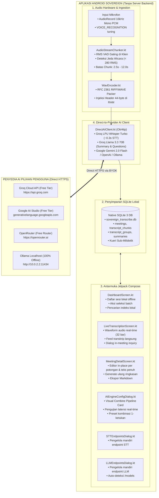

# Sovereign: Aplikasi Android Mandiri untuk Intelijen Wicara

**Arsitektur Local-First, Zero-Backend, Ingesti Audio Real-Time, Perumusan Pertanyaan Rapat & Ringkasan Eksekutif Langsung di Perangkat Android**

[](LICENSE)
[](https://developer.android.com/)
[](https://kotlinlang.org/)
[](https://sqlite.org/)
[]()
[](https://groq.com/)

---

> 🌐 **Bahasa:** [English](README.md) | **Bahasa Indonesia**

---

## 1. Ringkasan Eksekutif & Paradigma Pure Client-Side

**Sovereign** adalah aplikasi Android murni yang menghadirkan transkripsi wicara rapat secara *real-time*, rekomendasi pertanyaan kontekstual selama diskusi, dan perangkuman eksekutif langsung pada perangkat ponsel Anda **tanpa memerlukan server backend, basis data terpusat, atau perantara cloud berbayar**.

Jika layanan SaaS komersial (Otter.ai, Fireflies.ai) membebankan biaya langganan bulanan ($17–$18/bulan), menerapkan *vendor lock-in*, dan menyimpan rekaman audio rapat rahasia di server pihak ketiga, Sovereign beroperasi dengan **Arsitektur Local-First Penuh**:

* **Nol Server Backend:** Tanpa server Go, API Python, kontainer Docker, atau server remote yang harus di-maintain. Aplikasi 100% mandiri di sisi klien.
* **Penyimpanan 100% On-Device (Native SQLite 3):** Seluruh sesi rapat, potongan audio, transkrip, dan ringkasan eksekutif tersimpan dalam basis data SQLite lokal (`sovereign_transcribe.db`) di dalam sandbox privat Android.
* **Pengodean Audio In-Memory Langsung di RAM:** Audio mentah 16kHz 16-bit Mono Linear PCM dari `AudioRecord` dipotong dan dikemas ke dalam format kontainer RIFF/WAVE (RFC 2361) secara biner di RAM (`WavEncoder.kt`).
* **Streaming VAD Chunker di Klien:** Deteksi jeda wicara (VAD) berbasis energi RMS (< 50 RMS peredam hening, < 280 RMS pemotong jeda wicara) berjalan langsung di coroutine Android, menghemat ~78% bandwidth transfer data.
* **Pemisahan Konfigurasi Endpoint STT & LLM:** Endpoint Voice (STT) dan Penalaran (LLM) dikonfigurasi mandiri melalui menu drawer khusus. Pengguna bebas menggabungkan model STT dan model penalaran apa pun ke dalam satu *pipeline* aktif.
* **Koneksi Klien-ke-Penyedia AI Langsung:** Aplikasi menghubungi API penyedia AI (Groq Cloud Whisper Turbo, Google AI Studio Gemini 2.0 Flash, OpenAI Whisper-1, DeepSeek, xAI Grok, atau Ollama lokal) melalui HTTPS langsung menggunakan API key pribadi pengguna (*Bring Your Own Key*).
* **Dukungan Kuota Gratis Resmi (Verified Free Tier):** Terintegrasi langsung dengan penyedia kuota gratis tanpa kartu kredit (Groq Whisper Turbo & Llama 3.3, Google Gemini 2.0 Flash konteks 1 juta token, OpenRouter `:free`, dan Ollama localhost).
* **Brankas Kriptografis Hardware Keystore:** Kunci API pengguna disimpan terenkripsi di **Android Keystore (AES-256-GCM)** via `EncryptedSharedPreferences`. Kunci tidak pernah terkirim ke server mana pun.
* **100% Open Source:** Dirilis di bawah lisensi terbuka **MIT License**.

---

## 2. Arsitektur Klien Mandiri



---

## 3. Matriks Penyedia Kuota Gratis (Verified Free Tier)

| Penyedia | Fungsi | Endpoint | Model Bawaan | Kuota Gratis | Kartu Kredit |
| :--- | :---: | :--- | :--- | :--- | :---: |
| **Groq Cloud** | **STT (Suara)** | `https://api.groq.com/openai/v1/audio/transcriptions` | `whisper-large-v3-turbo` | 20–30 RPM, 14.400 RPD (~0.3s LPU) | **Tidak Perlu** |
| **Groq Cloud** | **LLM (Nalar)** | `https://api.groq.com/openai/v1/chat/completions` | `llama-3.3-70b-versatile` | 30 RPM, 14.400 RPD (~1.8s LPU) | **Tidak Perlu** |
| **Google AI Studio** | **LLM (Nalar)** | `https://generativelanguage.googleapis.com/v1beta/models/...` | `gemini-2.0-flash` | 15 RPM, 1.500 RPD (Konteks 1 Juta Token) | **Tidak Perlu** |
| **OpenRouter** | **LLM (Nalar)** | `https://openrouter.ai/api/v1/chat/completions` | `meta-llama/llama-3.3-70b-instruct:free` | 50 request gratis/hari | **Tidak Perlu** |
| **Ollama Local** | **STT & LLM** | `http://10.0.2.2:11434/v1/...` | `whisper` / `llama3.2` | Tanpa Batas (100% Offline di Komputer) | **Tidak Perlu** |

---

## 4. Kompilasi & Pemasangan Biner APK

### Kebutuhan Sistem
* JDK 17 atau JDK 21
* Android SDK 35 (minSdk 26 — Android 8.0 Oreo ke atas)

### Kompilasi Biner Rilis
```bash
# 1. Kloning repositori
git clone https://github.com/paperalt/sovereign.git
cd sovereign

# 2. Berikan izin eksekusi pada wrapper Gradle
chmod +x gradlew

# 3. Kompilasi biner rilis APK
./gradlew assembleRelease

# Lokasi file APK hasil kompilasi:
# app/build/outputs/apk/release/app-release.apk
```

### Pemasangan langsung via ADB
```bash
adb install -r app/build/outputs/apk/release/app-release.apk
```

---

## 5. Perbandingan Spesifikasi Teknis

| Fitur | Sovereign (Android Standalone) | Cloud SaaS (Otter.ai, dll.) |
| :--- | :---: | :---: |
| **Server Backend** | **TIDAK ADA (100% Lokal di Ponsel)** | Cloud Gateway Tertutup |
| **Penyimpanan Data** | **SQLite 3 Lokal di Sandbox Aplikasi** | Server Cloud Vendor |
| **Enkoding Audio** | **On-Device (WavEncoder 16kHz)** | Transcode Cloud / Server |
| **Latensi Jaringan** | **Direct HTTPS (~300ms via Groq)** | Lambat (WebSocket Hop + Antrean Server) |
| **Biaya Layanan** | **Rp 0 / bulan (Free & Open Source)** | Rp 250.000+ / bulan |
| **Privasi Data** | **Zero-Knowledge (Data tidak keluar HP)** | Dimonitisasi oleh Vendor |
| **Brankas Kunci API** | **Hardware Keystore AES-256-GCM** | Disimpan di server vendor |
| **Lisensi** | **MIT License** | Kepemilikan Tertutup (Proprietary) |

---

## 6. Repositori & Lisensi

* **Repositori GitHub:** [`https://github.com/paperalt/sovereign`](https://github.com/paperalt/sovereign)
* **Pengembang:** [`@paperalt`](https://github.com/paperalt)
* **Lisensi:** [MIT License](LICENSE)
